# DocuMind AI — Document Q&A SaaS (RAG)

**Chat with your documents.** Upload PDF, TXT, or DOCX files into a private workspace, ask questions, and get answers grounded in your content — with **chunk-level citations** you can verify.

Built as a full-stack SaaS MVP: JWT auth, multi-workspace isolation, async (or inline) document ingestion, hybrid retrieval, LLM answers (Groq / OpenAI), optional Stripe billing, and optional Resend email.

| | |
|---|---|
| **Live UI** | `http://localhost:5173` (after local setup) |
| **API** | `http://localhost:8000` · docs at `/docs` |
| **Demo login** | `demo@documind.ai` / `Demo1234!` (after `seed.py`) |
| **License** | [MIT](LICENSE) |

---

## Why this project

- **Portfolio / GitHub** — end-to-end RAG product, not a notebook demo
- **Client MVP** — clear upgrade path (pgvector, streaming, org RBAC, metering)
- **Learning reference** — FastAPI + React implementation of ingest → embed → retrieve → generate → cite

---

## Features

### Working today
- **Auth** — register, login, JWT access + refresh, profile update, change password
- **Workspaces** — create / switch / isolate documents and chats per workspace
- **Documents** — upload PDF / TXT / DOCX (max **25MB**), list, detail, delete, inspect extracted chunks
- **Ingestion pipeline** — extract → chunk (overlap) → embed → store; status `pending` → `processing` → `ready` / `failed`
- **Hybrid RAG chat** — vector cosine similarity + BM25, fused with Reciprocal Rank Fusion (RRF), optional neighbor-chunk expansion
- **Citations** — document name, chunk id, page (when available), excerpt
- **Dashboard** — workspace stats (docs, chats, queries, ingestion success)
- **Theme** — light / dark UI
- **Billing (optional)** — Stripe Checkout, Customer Portal, webhook sync of subscription status
- **Email (optional)** — verify email + password reset via Resend (no-op if unset)

### Honest MVP limits
- Stripe syncs plan **status** only — upload/chat **quotas are not enforced** yet
- Email flows need `RESEND_API_KEY` or they silently no-op
- Social login buttons on auth pages are **UI-only** (not wired)
- Embeddings live in Postgres as `float[]`; similarity is computed in Python (`pgvector` is a dependency for a future upgrade, not used in queries yet)

---

## How it works

### 1. System architecture

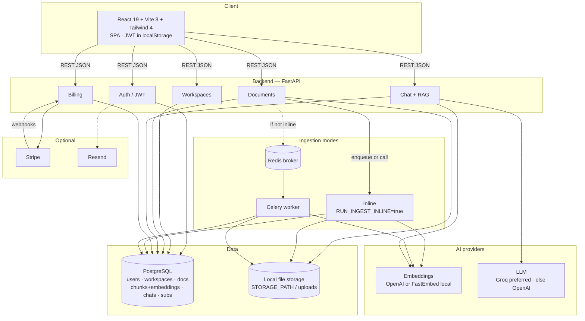

### 2. Document ingestion pipeline

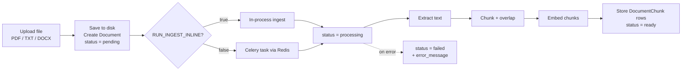

### 3. Ask flow (hybrid RAG)

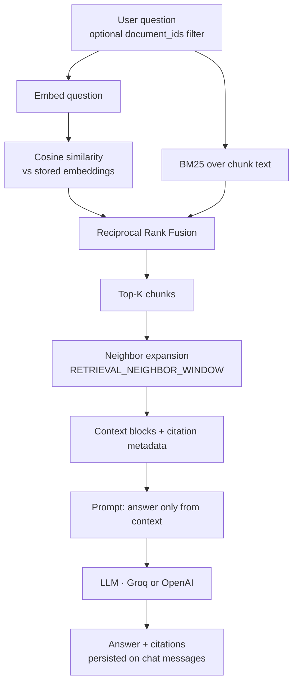

### 4. Sequence: upload then ask

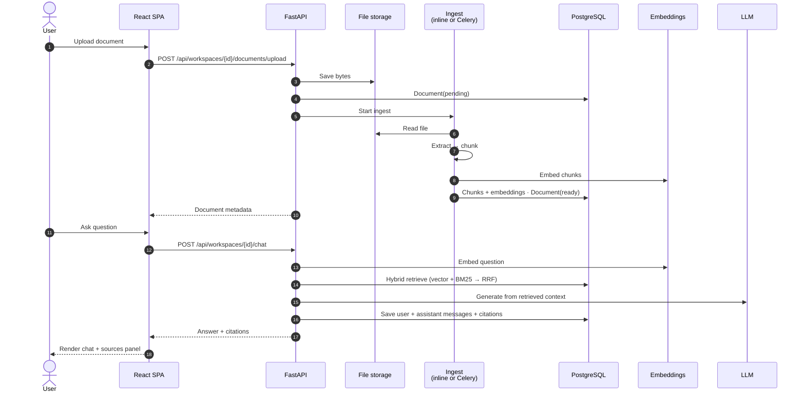

### 5. Data model (simplified)

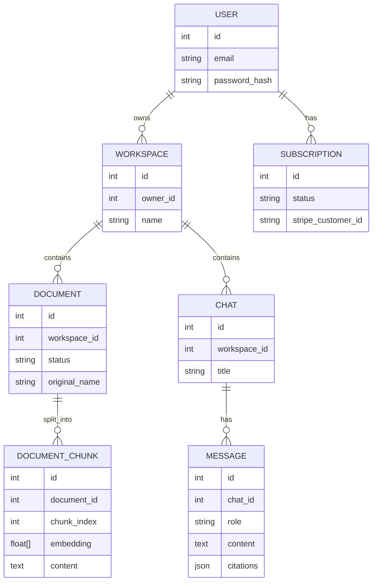

---

## Tech stack

| Layer | Choices |
|---|---|
| **Frontend** | React 19, TypeScript, Vite 8, React Router 7, Tailwind CSS 4, Lucide icons |
| **Backend** | FastAPI, SQLAlchemy 2, Alembic, Pydantic v2, Celery, Redis |
| **Database** | PostgreSQL (psycopg3) |
| **Embeddings** | OpenAI `text-embedding-3-small` **or** local FastEmbed `BAAI/bge-small-en-v1.5` |
| **LLM** | Groq (`llama-3.1-8b-instant`) preferred · else OpenAI (`gpt-4o-mini`) |
| **Retrieval** | Cosine similarity + BM25 + RRF (+ neighbor window) |
| **Billing** | Stripe Checkout / Portal / webhooks |
| **Email** | Resend (optional) |
| **Infra** | Docker Compose · local disk uploads |

---

## Project structure

```text
ai-document-q-a-saas/
├── frontend/                 # React SPA
│   ├── src/
│   │   ├── app/              # Router
│   │   ├── auth/             # Auth context + token storage
│   │   ├── components/       # Layout, UI primitives
│   │   ├── pages/            # Landing, auth, dashboard, docs, chat, billing, settings
│   │   ├── services/         # API clients
│   │   └── workspaces/       # Active workspace context
│   ├── UI/                   # Portfolio screenshots
│   └── scripts/              # Screenshot capture (Playwright)
├── backend/
│   ├── app/
│   │   ├── api/routes/       # HTTP endpoints
│   │   ├── services/         # Auth, docs, retrieval, LLM, embeddings, Stripe, email
│   │   ├── tasks/            # Celery ingest
│   │   ├── models/           # SQLAlchemy models
│   │   ├── schemas/          # Pydantic schemas
│   │   ├── core/             # Config, DB, security
│   │   └── utils/            # Extraction, chunking
│   ├── alembic/              # Migrations
│   ├── seed.py               # Demo user + sample docs
│   └── uploads/              # Local files (gitignored)
├── docker-compose.yml
└── README.md
```

---

## Quick start (local)

### Prerequisites
- Node.js **20+**
- Python **3.11+**
- PostgreSQL **16+** (local or Supabase)
- Optional: Redis **7+** (only if `RUN_INGEST_INLINE=false`)

### 1) Backend

```bash
cd backend
python -m venv .venv
.\.venv\Scripts\pip install -r requirements.txt
copy .env.example .env
# Edit .env — set DATABASE_URL, JWT_SECRET, and preferably:
#   RUN_INGEST_INLINE=true
#   GROQ_API_KEY=...   (or OPENAI_API_KEY)
.\.venv\Scripts\python -m alembic -c alembic.ini upgrade head
.\.venv\Scripts\python -m uvicorn app.main:app --reload --port 8000
```

Health: [http://localhost:8000/health](http://localhost:8000/health) · OpenAPI: [http://localhost:8000/docs](http://localhost:8000/docs)

**Seed demo data** (optional):

```bash
.\.venv\Scripts\python seed.py
```

| Field | Value |
|---|---|
| Email | `demo@documind.ai` |
| Password | `Demo1234!` |
| Workspace | `Acme Support` |

### 2) Frontend

```bash
cd frontend
npm install
# optional: create .env with VITE_API_BASE_URL=http://localhost:8000
npm run dev
```

App: [http://localhost:5173](http://localhost:5173)

### 3) Celery mode (optional)

If `RUN_INGEST_INLINE=false`:

```bash
# terminal A — Redis must be running
# terminal B
cd backend
.\.venv\Scripts\celery -A app.tasks.celery_app worker --loglevel=info
```

### Docker

```bash
# Set GROQ_API_KEY or OPENAI_API_KEY in the environment, then:
docker compose up --build
```

---

## Environment variables

### Frontend (`frontend/.env`)

| Variable | Purpose |
|---|---|
| `VITE_API_BASE_URL` | Backend origin (default `http://localhost:8000`) |

### Backend (`backend/.env`)

| Variable | Purpose |
|---|---|
| `DATABASE_URL` | Postgres URL (`postgresql+psycopg://…`) |
| `DIRECT_URL` | Optional session/direct URL for Alembic (e.g. Supabase port `5432`) |
| `JWT_SECRET` | Signing secret — use a long random value outside local demos |
| `BACKEND_CORS_ORIGINS` | Comma-separated origins (e.g. `http://localhost:5173`) |
| `STORAGE_PATH` | Upload directory (default `uploads`) |
| `RUN_INGEST_INLINE` | `true` = ingest in API process (best for Windows / no Redis) |
| `REDIS_URL` | Celery broker when not inline |
| `GROQ_API_KEY` | Preferred LLM |
| `OPENAI_API_KEY` | OpenAI embeddings and/or LLM fallback |
| `OPENAI_EMBEDDING_MODEL` | Default `text-embedding-3-small` |
| `LOCAL_EMBEDDING_MODEL` | Default `BAAI/bge-small-en-v1.5` |
| `LLM_MODEL` | Groq default `llama-3.1-8b-instant` |
| `CHUNK_SIZE` / `CHUNK_OVERLAP` | Chunking |
| `RETRIEVAL_TOP_K` / `RETRIEVAL_NEIGHBOR_WINDOW` | Retrieval |
| `STRIPE_*` | Optional billing |
| `RESEND_API_KEY` / `EMAIL_FROM` / `FRONTEND_BASE_URL` | Optional email |
| `REQUIRE_EMAIL_VERIFICATION` | Gate login on verified email |

See `backend/.env.example` for a full template.

---

## API overview

Interactive docs: `GET /docs`

| Area | Endpoints |
|---|---|
| **Auth** | `POST /api/auth/register` · `login` · `refresh` · `GET /me` · `PUT /profile` · `POST /change-password` · verify / forgot / reset |
| **Workspaces** | `GET/POST /api/workspaces` · `GET /{id}` · `GET /{id}/stats` |
| **Documents** | `GET/POST …/documents` · `GET/DELETE /api/documents/{id}` · `GET …/chunks` |
| **Chat** | `GET/POST …/chats` · `GET …/chats/recent` · `GET /api/chats/{id}/messages` · `POST …/chat` (ask) · `DELETE` chat |
| **Billing** | `GET …/billing/workspaces/{id}` · `checkout` · `portal` · `POST /api/billing/webhook` |
| **Health** | `GET /health` |

---

## Screenshots

Screenshots live in [`frontend/UI/`](frontend/UI/). Regenerate after UI changes:

```bash
cd frontend
npx playwright install chromium
npm run screenshots
```

Uses the seeded demo account (`demo@documind.ai`).

### Product

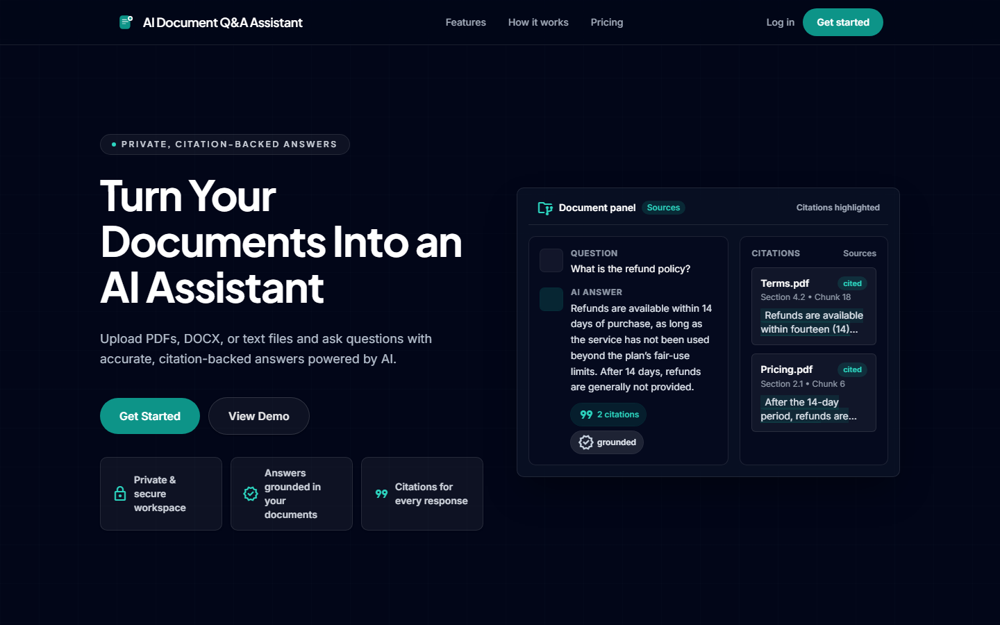
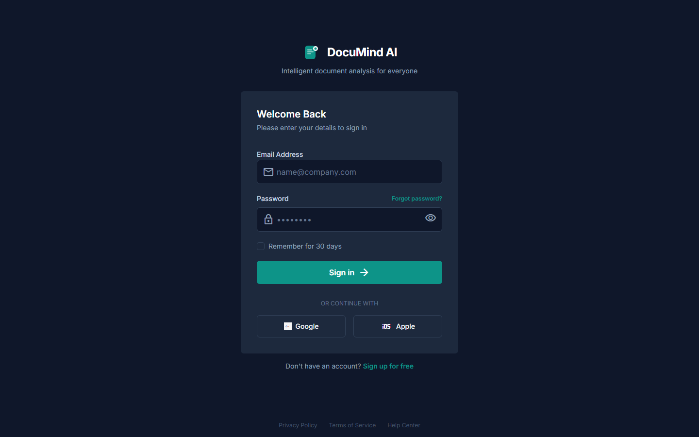

### App — light

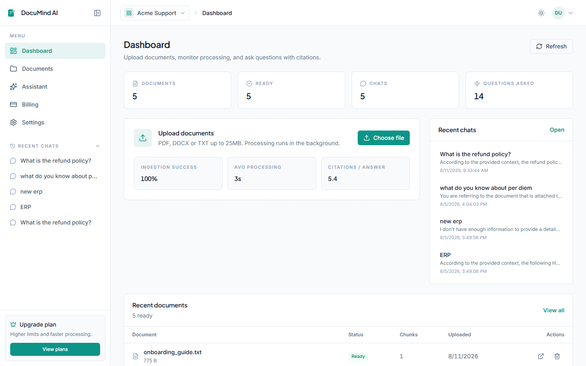
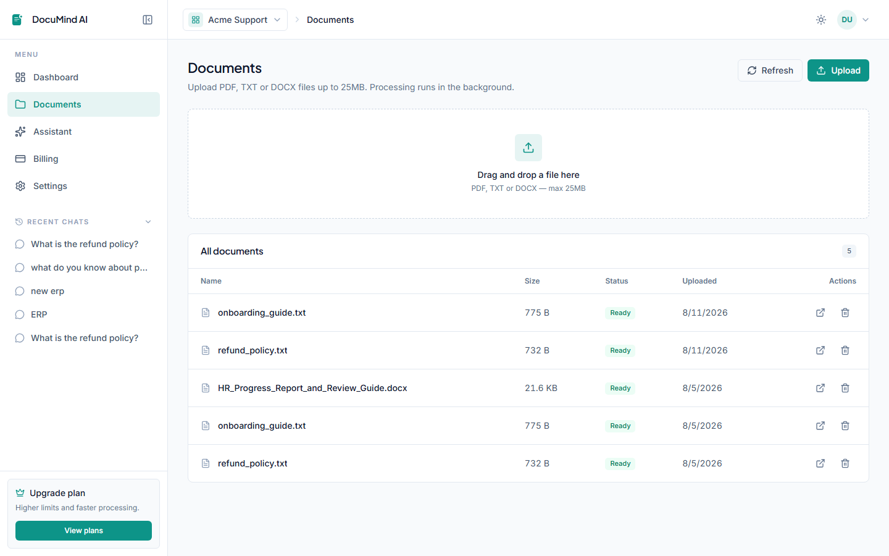
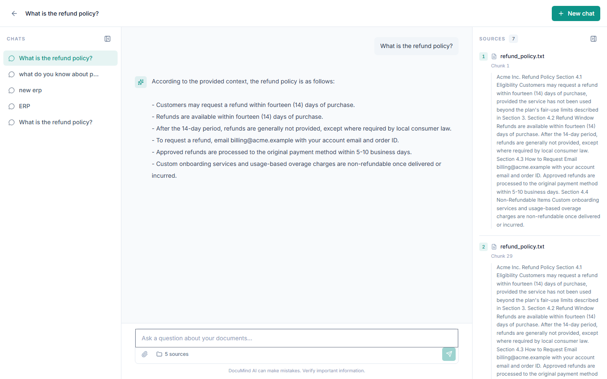
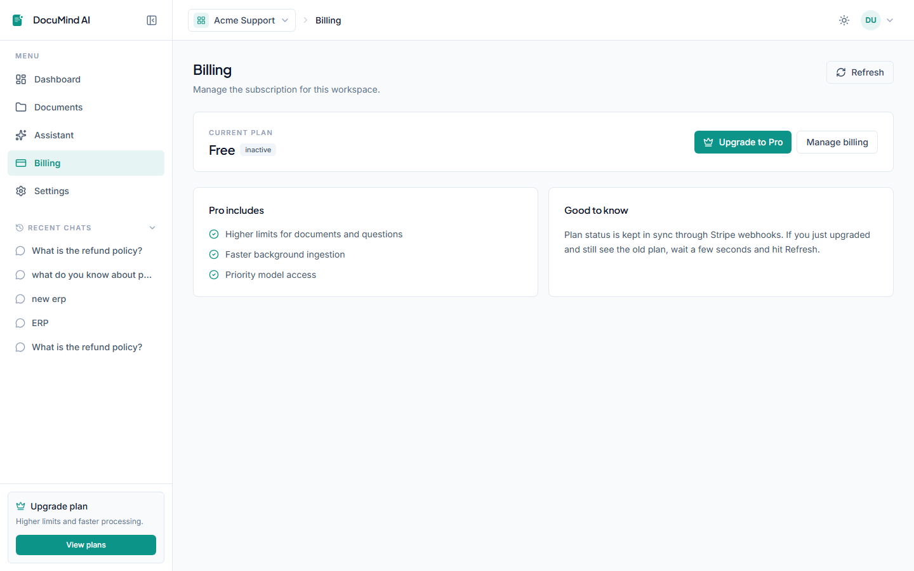
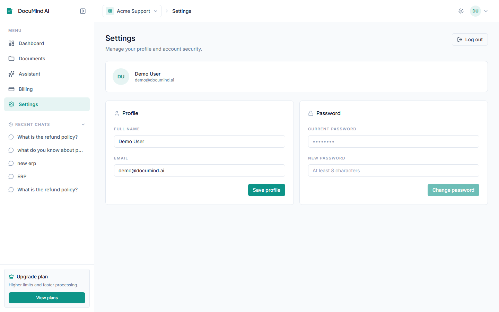

### App — dark

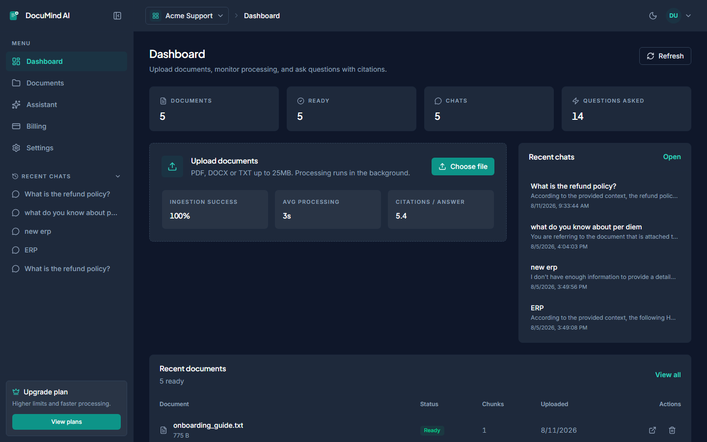
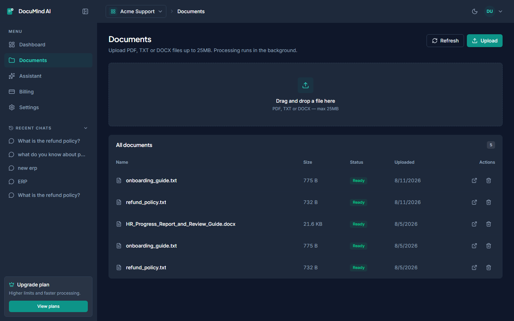
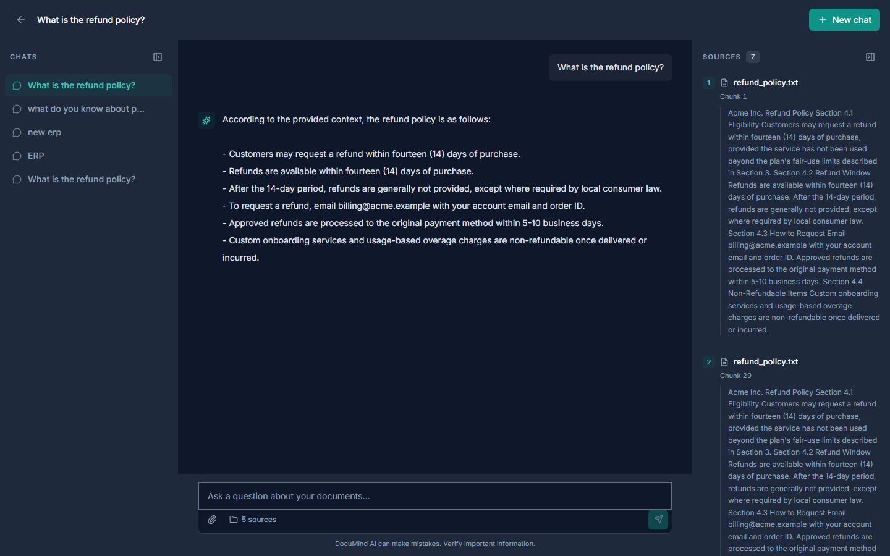
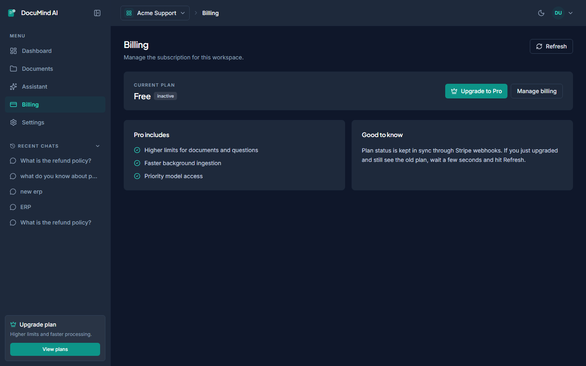
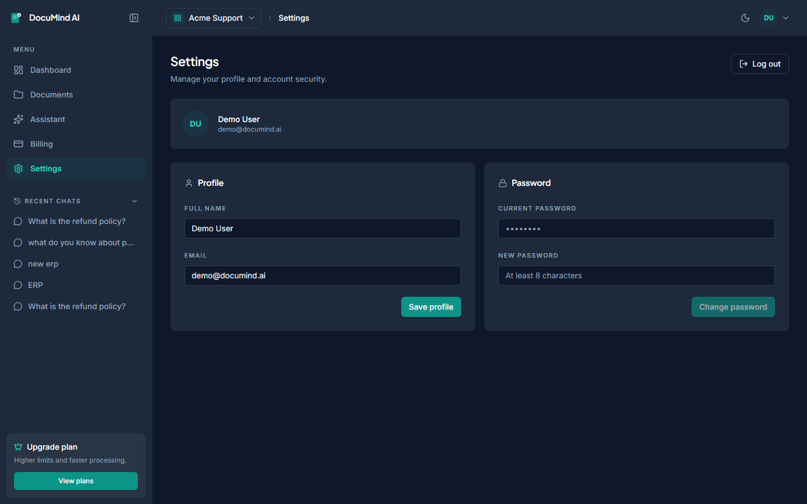

---

## Roadmap

High-impact upgrades for a production SaaS:

- [ ] **pgvector** + HNSW/IVFFlat (move similarity into Postgres)
- [ ] **Streaming** answers (SSE / WebSockets)
- [ ] **Plan enforcement** (document / query limits from Stripe status)
- [ ] Org **RBAC** (members, roles, shared workspaces)
- [ ] Rate limiting + usage metering
- [ ] OCR / more formats (scanned PDF, PPTX, HTML)
- [ ] Object storage (S3) instead of local disk
- [ ] Eval harness for retrieval + answer quality

---

## License

[MIT](LICENSE) © 2026 Samuel Hailemariam Seifu

---

## Links

- Backend notes: [`backend/README.md`](backend/README.md)
- Frontend notes: [`frontend/README.md`](frontend/README.md)
- Hire / custom RAG & SaaS builds — open an issue or reach out via GitHub profile
